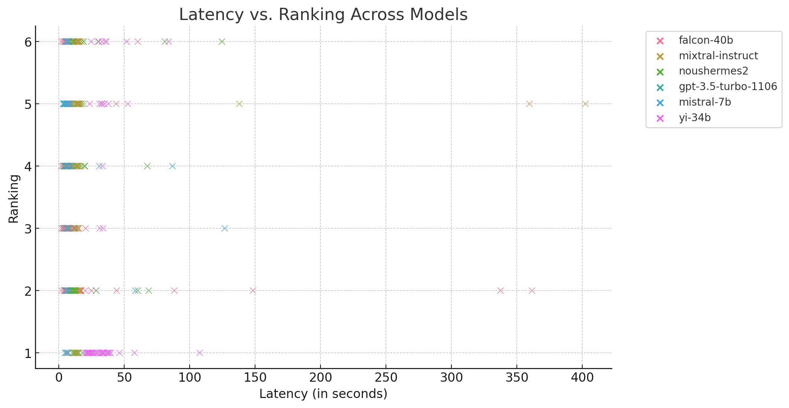
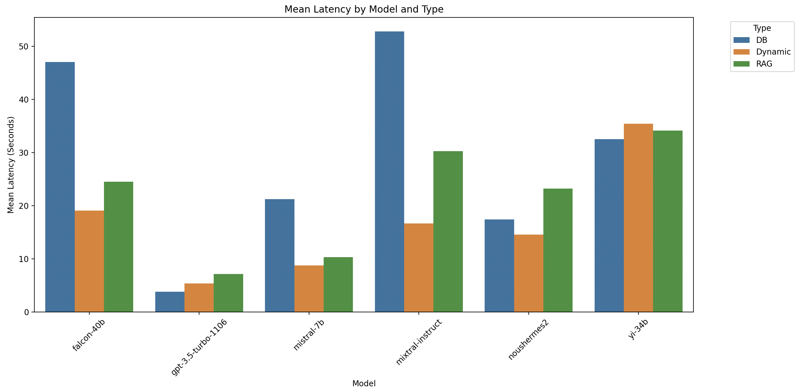
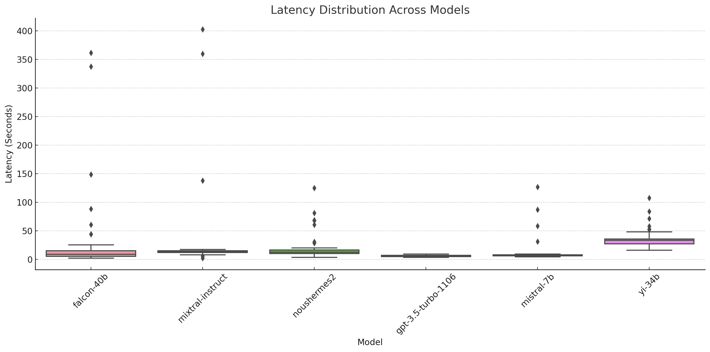

# galen-evals
A coworker for life sciences
- one who also shows you their work and tells you what to choose!

# What you need to run this
1. OpenAI API key
2. Replicate API key
3. Add them to your .env file

# Steps
1. Update the configfile.json if needed. Oh and check the knowledgebase.json and perturbations.json inside utils to see if they have verisimilitude!
2. Run the perturbations file to get various OSS LLM responses, choose the ones you want in the code
3. Run response_gpt4 same to get GPT-4 responses
4. Do the same for DB and RAG files, having put the relevant parts in the folders
5. Combine the results files, then change the format to select combined file
5. Run eval_by_gpt4 to get GPT-4 to evaluate the answers
6. Run human eval if you can

# Charts!

Yi-34b seems remarkably good!

Interesting: the performance from Yi is wow!

Once again, Yi wins here ... 

GPT is the one that's solved cold start problem the best

# Files
The crucial ones are:
1. questions.xlsx, which has the list of Questions we want to ask. This is the starting point, and what you should start with!
2. "results grouped by question" which has the final list of answers from all LLMs
3. model_rankings.xlsx with the rankings for the final list of answers that were evaluated
4. All other files are intermediate creations, kept for auditing and any error checks

# To do
There's plenty to do, but in no order:
1. Change storage from csv to something better, and store them inside folders [Done]
2. Clean up the answer formatting [Done]
3. Speed up GPT execution by parallelising the API calls
4. Add checks against local files for specific models
5. Create a "Best Answer" for the questions in case we want to measure the answers against that - (can also use this to DPO the models later as needed)
6. Create a way to perturb the questions to see how well the LLMs react to new info coming in [Done]
7. Create a way to provide a "knowledgebase" to see how good the LLMs are at asking for help from the right quarters [Done]
8. Add answer clusters and plotting w.r.t categories to the automated model ranking file